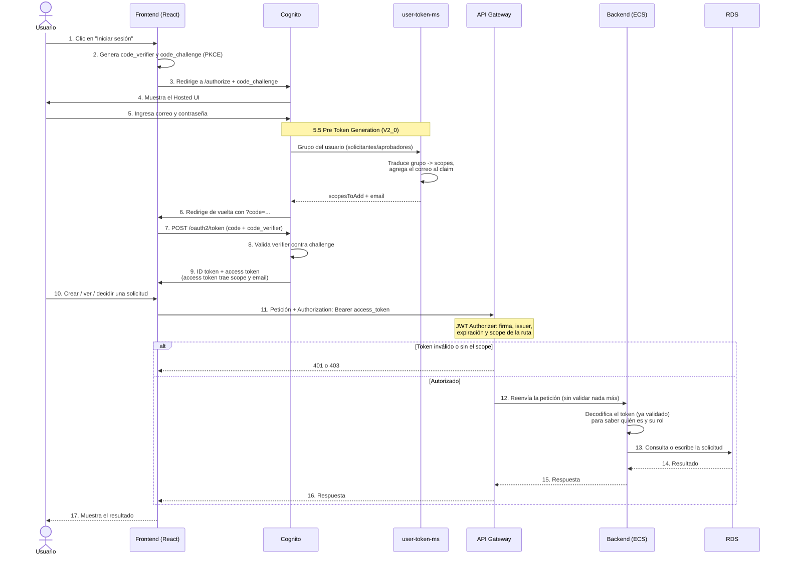

# DSY1107 - PARCIAL1 - Solicitudes de Vacaciones

Sistema de solicitante/aprobador: un usuario solicita vacaciones, otro las
aprueba o rechaza con un comentario.

## Qué hace

- Un **solicitante** inicia sesión, crea una solicitud (fecha de inicio, fecha
  de fin, motivo), y puede ver, editar o eliminar sus propias solicitudes
  mientras estén en estado `PENDIENTE`.
- Un **aprobador** inicia sesión con otra cuenta, ve todas las solicitudes
  pendientes de todos los solicitantes, y aprueba o rechaza cada una con un
  comentario obligatorio.
- La autorización real, quién puede llamar a cada ruta, según el scope que trae el access token la decide el API Gateway, no el backend: el backend no contiene ningún if de permisos. El backend sí valida que el token sea auténtico (firma, issuer y expiración, vía spring-boot-starter-oauth2-resource-server), como una segunda capa de defensa en caso de que alguien alcance el puerto 8080 saltándose el gateway; pero esa validación nunca decide qué puede hacer el usuario, solo si el token es legítimo. Para saber de quién es cada solicitud, el backend lee el claim email del mismo token ya validado.

  ## Flujo completo



Los pasos 1 a 9 son el login (Authorization Code + PKCE, RFC 7636); nunca
tocan el backend. El paso 5.5 es lo que hace que la autorización dependa de
la *persona*, no solo del cliente: sin él, todos los usuarios autenticados
recibirían los mismos scopes. Del paso 10 en adelante es el uso normal de la
aplicación — cada petición es independiente y lleva su propio token.

## Cómo funciona la autorización

1. Cada usuario pertenece a un grupo de Cognito: `solicitantes` o
   `aprobadores`.
2. Un Lambda (`user-token-ms`), disparado por Cognito en cada login
   (Pre Token Generation V2), traduce el grupo del usuario en scopes:
   - `solicitantes` → `solicitudes/read`, `solicitudes/write`
   - `aprobadores` → `solicitudes/read`, `solicitudes/aprobar`
3. El mismo Lambda agrega el correo del usuario al access token
   (`claimsToAddOrOverride`), porque el access token no lo trae por defecto y
   el backend lo necesita para saber de quién es cada solicitud.
4. El API Gateway exige el scope correspondiente en cada ruta
   (`authorization_scopes` en `terraform/main.tf`):

   | Ruta | Método | Scope exigido |
   |---|---|---|
   | `/solicitudes` | GET | `solicitudes/read` |
   | `/solicitudes` | POST | `solicitudes/write` |
   | `/solicitudes/{id}` | GET, PUT, DELETE | `solicitudes/read` o `solicitudes/write` |
   | `/solicitudes/{id}/decision` | PUT | `solicitudes/aprobar` |

   Si el token no trae el scope, el gateway responde 403 y la petición nunca
   llega al backend.

## Endpoints

Todos requieren `Authorization: Bearer <access_token>`, salvo que se indique
lo contrario. El backend nunca valida el token — si la petición llega hasta
`SolicitudController`, es porque el API Gateway ya la autorizó.

### `GET /solicitudes`
**Scope:** `solicitudes/read`
Lista las solicitudes. Un solicitante ve solo las suyas; un aprobador ve
todas, sin filtrar por dueño (el backend decide según `cognito:groups` del
token, no según parámetros de la petición).

| Resultado | Cuándo |
|---|---|
| `200` | Token válido, con `solicitudes/read`. Devuelve un arreglo (puede ir vacío). |
| `401` | Falta el token, está mal firmado o expiró. |
| `403` | Token válido, pero sin `solicitudes/read`. |

### `GET /solicitudes/{id}`
**Scope:** `solicitudes/read`
Una solicitud puntual.

| Resultado | Cuándo |
|---|---|
| `200` | Existe, y quien pregunta es su dueño o es aprobador. |
| `401` | Falta el token o es inválido. |
| `403` (API Gateway) | Token sin `solicitudes/read`. |
| `403` (backend) | Token válido con el scope, pero la solicitud no es del solicitante que pregunta (y no es aprobador). |
| `404` | No existe ninguna solicitud con ese id. |

### `POST /solicitudes`
**Scope:** `solicitudes/write`
Crea una solicitud nueva. El `solicitanteEmail` sale del claim `email` del
token — nunca del cuerpo de la petición.

```json
{
  "fechaInicio": "2026-12-20",
  "fechaFin": "2026-12-30",
  "motivo": "Vacaciones de fin de año"
}
```

| Resultado | Cuándo |
|---|---|
| `201` | Creada. Devuelve la solicitud completa, con `id`, `estado: "PENDIENTE"` y `creadoEn`. |
| `400` | Falta un campo obligatorio, o `fechaInicio` es una fecha pasada. |
| `401` | Falta el token o es inválido. |
| `403` | Token sin `solicitudes/write` (por ejemplo, un aprobador). |

### `PUT /solicitudes/{id}`
**Scope:** `solicitudes/write`
Edita `fechaInicio`, `fechaFin` y `motivo` de una solicitud propia. Mismo
cuerpo que `POST`.

| Resultado | Cuándo |
|---|---|
| `200` | Editada. |
| `400` | Cuerpo inválido. |
| `401` | Falta el token o es inválido. |
| `403` (API Gateway) | Token sin `solicitudes/write`. |
| `403` (backend) | La solicitud no es del solicitante que pregunta. |
| `404` | No existe. |
| `409` | La solicitud ya fue aprobada o rechazada (solo se puede editar en `PENDIENTE`). |

### `DELETE /solicitudes/{id}`
**Scope:** `solicitudes/write`
Elimina una solicitud propia, solo si sigue `PENDIENTE`.

| Resultado | Cuándo |
|---|---|
| `204` | Eliminada. Sin cuerpo. |
| `401` | Falta el token o es inválido. |
| `403` (API Gateway) | Token sin `solicitudes/write`. |
| `403` (backend) | No es el dueño. |
| `404` | No existe. |
| `409` | Ya fue decidida. |

### `PUT /solicitudes/{id}/decision`
**Scope:** `solicitudes/aprobar`
Aprueba o rechaza una solicitud pendiente. Solo un aprobador llega aquí — lo
garantiza el scope de la ruta, no una validación en el código.

```json
{
  "estado": "APROBADA",
  "comentario": "Aprobado, coordinar entrega de pendientes antes de salir"
}
```

`estado` debe ser `"APROBADA"` o `"RECHAZADA"`.

| Resultado | Cuándo |
|---|---|
| `200` | Decidida. Devuelve la solicitud con `estado` y `comentarioAprobador` actualizados. |
| `400` | Falta el comentario, o `estado` no es uno de los dos valores válidos. |
| `401` | Falta el token o es inválido. |
| `403` | Token sin `solicitudes/aprobar` (por ejemplo, un solicitante). |
| `404` | No existe. |
| `409` | La solicitud ya fue decidida antes. |

### Probar sin desplegar nada — con curl

Conseguir un token directamente, sin pasar por el frontend:

```bash
aws cognito-idp initiate-auth \
  --auth-flow USER_PASSWORD_AUTH \
  --client-id <COGNITO_CLIENT_ID> \
  --auth-parameters USERNAME=test@duoc.cl,PASSWORD=Duoc2026
```

Copiar el `AccessToken` de la respuesta y usarlo:

```bash
curl -s -X POST https://<API_ID>.execute-api.us-east-1.amazonaws.com/dev/solicitudes \
  -H "Authorization: Bearer $TOKEN" \
  -H "Content-Type: application/json" \
  -d '{"fechaInicio":"2026-12-20","fechaFin":"2026-12-30","motivo":"prueba"}'
```

## Estructura del repositorio
```
/
├── .github/workflows/   # pipelines de GitHub Actions
├── backend/   # API REST en Spring Boot (Java 21, Maven)
│ ├── src/main/java/   # dominio "solicitudes": entidad, repositorio,
│ │ # servicio, controlador, lectura de claims del JWT
│ ├── src/main/resources/   # application.yaml, migración Flyway
│ ├── Dockerfile
│ └── pom.xml
├── frontend/       # SPA en React (Vite)
│ ├── src/         # auth.js (PKCE), api.js, config.js, App.jsx
│ └── public/     # aquí se escribe config.json en cada despliegue
├── user-token-ms/   # Lambda: grupo de Cognito -> scopes del token
│ └── index.mjs
├── terraform/     # infraestructura como código (AWS)
│ ├── cognito.tf     # user pool, dominio, resource server, grupos
│ ├── main.tf     # API Gateway: rutas, integraciones, autorizador
│ ├── ecs.tf     # backend en Fargate
│ ├── rds.tf     # base de datos PostgreSQL
│ ├── lambda.tf     # despliegue de user-token-ms
│ ├── amplify.tf     # hosting del frontend
│ └── variables.tf
├── scripts/ # config-frontend.sh, publicar-amplify.sh, publicar-ecs.sh
└── .gitignore              
```

## Levantar el proyecto

### 1. Infraestructura

```bash
cd terraform
terraform init
terraform apply
```

Esto crea todo: Cognito (user pool, dominio, grupos, resource server), el
Lambda, RDS, el API Gateway, la app de Amplify y el cluster de ECS (vacío,
sin ninguna imagen todavía — es normal que el servicio quede reintentando
hasta el primer despliegue).

### 2. Backend, en local

```bash
export SPRING_DATASOURCE_PASSWORD=<la clave de variables.tf>
cd backend
./mvnw spring-boot:run
```

Flyway crea la tabla `solicitud` automáticamente la primera vez. El backend
corre en `http://localhost:8080`.

### 3. Backend, en AWS

```bash
./scripts/publicar-ecs.sh
```

Construye la imagen, la sube a ECR, actualiza el servicio de ECS, y reapunta
las tres integraciones del API Gateway a la IP pública de la task nueva
(sin balanceador, esto hay que hacerlo después de cada despliegue).

### 4. Frontend, en local

```bash
cd frontend
npm install
```

Crear `frontend/public/config.json` a mano (no se versiona) con los valores
de `terraform output -raw config_frontend`, o copiarlos uno por uno desde
`terraform output`. Luego:

```bash
npm run dev
```

### 5. Frontend, en Amplify

Se publica automáticamente con GitHub Actions (`frontend_deploy.yml`) en
cada push a `main`, siempre que las variables del repositorio (Settings →
Secrets and variables → Actions) estén configuradas: credenciales de AWS,
región, dominio y client ID de Cognito, URL de redirección, URL del API, y
el ID de la app de Amplify.

## Usuarios de prueba

| Correo | Contraseña | Grupo |
|---|---|---|
| `test@duoc.cl` | `Duoc2026` | `solicitantes` |
| `solicitante2@duoc.cl` | `Duoc2026` | `solicitantes` |
| `aprobador@duoc.cl` | `Duoc2026` | `aprobadores` |

## Notas sobre el Learner Lab

Las credenciales de AWS son temporales y expiran al cerrar la sesión del
lab. Si `terraform apply`, `publicar-ecs.sh`, o un workflow de GitHub Actions
fallan con un error de credenciales o `AccessDenied` con `voc-cancel-cred`,
hay que reiniciar el lab, tomar credenciales nuevas, y (para GitHub Actions)
actualizar los tres secretos de AWS en el repositorio.
